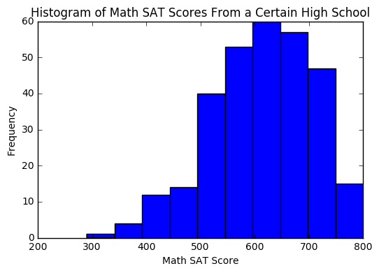

# Comparing Math Performance to National Average
Declan O'Neill

This report will compare a certain high school's performance on the math SAT to the national average of 513.

The data are held in [`sat_scores.csv`](./sat_scores.csv), telling the gender, verbal SAT score, and math SAT score for the students in this high school who took the SAT. To load it, we will use [pandas](https://pandas.pydata.org/), a python library built for working with and analyzing data.


```python
import pandas as pd
sat_df = pd.read_csv("sat_scores.csv")
print(sat_df)
```

        gender  verbal  math
    0        f     630   660
    1        f     590   580
    2        m     750   800
    3        m     600   690
    4        m     610   550
    5        f     490   800
    6        f     680   610
    7        m     520   540
    8        f     680   660
    9        m     650   700
    10       m     600   560
    11       f     550   560
    12       m     490   390
    13       f     530   530
    14       m     560   560
    15       f     630   590
    16       f     510   520
    17       m     710   740
    18       f     550   560
    19       m     690   620
    20       m     700   700
    21       m     540   620
    22       f     280   500
    23       m     710   760
    24       f     640   710
    25       m     600   590
    26       m     610   670
    27       m     680   670
    28       f     520   470
    29       f     730   740
    ..     ...     ...   ...
    273      f     570   530
    274      f     560   540
    275      f     670   520
    276      m     650   710
    277      f     690   700
    278      m     610   740
    279      f     500   650
    280      m     560   700
    281      m     640   650
    282      m     430   490
    283      f     700   570
    284      m     620   670
    285      f     610   640
    286      m     580   640
    287      f     730   570
    288      f     520   530
    289      m     540   580
    290      m     640   610
    291      m     680   720
    292      m     580   490
    293      f     640   630
    294      f     700   650
    295      m     600   630
    296      f     540   510
    297      f     480   540
    298      f     710   700
    299      m     650   780
    300      f     640   570
    301      f     370   410
    302      m     710   700
    
    [303 rows x 3 columns]
    

We don't need the gender or verbal SAT score columns, so let's create a new dataframe that only has a math SAT score column.


```python
math_sat_df = pd.DataFrame(sat_df["math"])
print(math_sat_df)
```

         math
    0     660
    1     580
    2     800
    3     690
    4     550
    5     800
    6     610
    7     540
    8     660
    9     700
    10    560
    11    560
    12    390
    13    530
    14    560
    15    590
    16    520
    17    740
    18    560
    19    620
    20    700
    21    620
    22    500
    23    760
    24    710
    25    590
    26    670
    27    670
    28    470
    29    740
    ..    ...
    273   530
    274   540
    275   520
    276   710
    277   700
    278   740
    279   650
    280   700
    281   650
    282   490
    283   570
    284   670
    285   640
    286   640
    287   570
    288   530
    289   580
    290   610
    291   720
    292   490
    293   630
    294   650
    295   630
    296   510
    297   540
    298   700
    299   780
    300   570
    301   410
    302   700
    
    [303 rows x 1 columns]
    

Although these data come from a census, and population parameters can be calculated, we will take a random sample and run a test upon that to compare this high school's math performance to the national average. To generate a sample, we will use [`pandas.DataFrame.sample`](https://pandas.pydata.org/pandas-docs/stable/generated/pandas.DataFrame.sample.html). For the test that will be done later, it is important that size of the sample not exceed 10% of the size of the population. We will take a sample with a size 9% of the population.


```python
math_sat_sample_df = math_sat_df.sample(frac=0.09)
print(math_sat_sample_df)
```

         math
    128   630
    274   540
    188   710
    136   470
    280   700
    78    660
    270   640
    281   650
    160   520
    273   530
    277   700
    272   630
    202   540
    94    570
    162   570
    99    550
    265   570
    230   530
    154   570
    268   700
    51    530
    302   700
    125   670
    43    560
    17    740
    38    580
    256   640
    

Now that we have our sample, we need to calculate it's summary statistics. For this, we will use [numpy](http://www.numpy.org/), a python library designed for scientific computing.


```python
import numpy as np

n                       = len(math_sat_sample_df)
degrees_of_freedom      = n-1
mean                    = float(np.mean(math_sat_sample_df))
standard_deviation      = float(np.std(math_sat_sample_df))
mean_standard_deviation = float(standard_deviation / np.sqrt(n))

print("n                       =", n)
print("degrees of freedom      =", degrees_of_freedom)
print("mean                    =", mean)
print("standard deviation      =", standard_deviation)
print("mean standard deviation =", mean_standard_deviation)
```

    n                       = 27
    degrees of freedom      = 26
    mean                    = 607.4074074074074
    standard deviation      = 71.88429966079455
    mean standard deviation = 13.834139919889154
    

With these statistics calculated, we can run a **one-sample two-tail t-test** to compare this high school's math performance to the national average. Before we do, though, we have to check certain conditions.

### 1. Random sample of math SAT scores from this high school
We used [`pandas.DataFrame.sample`](https://pandas.pydata.org/pandas-docs/stable/generated/pandas.DataFrame.sample.html), which generates a pseudo-random sample. It may not be perfect, but it's random enough.

### 2. n is less than 10% of the total population of math SAT scores from this high school
We kept this in mind when generating the sample, using only 9% of the total population of math SAT scores from this high school. This condition checks out.

### 3. Sample comes from a distribution that is unimodal and symmetric
Let's generate a histogram of all the data. We'll use [matplotlib](https://matplotlib.org/), a python library for plotting data.


```python
%matplotlib inline
from matplotlib import pyplot as plt

plt.xlabel('Math SAT Score')
plt.ylabel('Frequency')
plt.title('Histogram of Math SAT Scores From a Certain High School')
plt.hist(sat_df["math"])
```


    (array([  1.,   4.,  12.,  14.,  40.,  53.,  60.,  57.,  47.,  15.]),
     array([ 290.,  341.,  392.,  443.,  494.,  545.,  596.,  647.,  698.,
             749.,  800.]),
     <a list of 10 Patch objects>)





It could be said that the data are unimodal skewed left, but they will be *"normal enough"* to work with.

With these conditions met, we may run the **one-sample two-tail t-test**. Let's define the null and alternative hypotheses.

$$H_{0}: \mu = 513$$
$$H_{A}: \mu ≠ 513$$

The null hypothesis ($H_{0}$) states that the true mean of math SAT scores is equal to 513, the national average.

The alternative hypothesis ($H_{A}$) states that the true mean of math SAT scores is not equal to 513, the national average.

We can determine whether the null hypothesis should be accepted or not by calculating the t-statistic and its corresponding p-value.

$$t-statistic = t_{df} = \frac{\bar{X} - \mu_{0}}{SE(\bar{X})}$$

$df$ represents the degrees of freedom, $\bar{X}$ represents the mean of our sample, $\mu_{0}$ represents the national average, and $SE(\bar{X})$ represents the mean standard deviation of our sample.


```python
t_stat = (mean - 513) / mean_standard_deviation
print("t-statistic =", t_stat)
```

    t-statistic = 6.824233957015221
    

To find the p-value of a two-tailed t-test, we take the probability that any t-statistic from a student's t-distribution with the same degrees of freedom would be greater than or equal to this one, and then multiply it by two.

$$p-value = 2P(t_{26} ≥ t-statistic)$$

[scipy](https://www.scipy.org/) has a convenient function for calculating such probabilities: `scipy.stats.t.sf`


```python
import scipy.stats

p_val = 2 * scipy.stats.t.sf(t_stat, degrees_of_freedom)
alpha = 0.05

if p_val < alpha:
    print("With a p-value of %s%%, this test rejects the null hypothesis in favor of the alternative" % (round(p_val*100,4)))
else:
    print("With a p-value of %s%%, this test fails to reject the null hypothesis" % (round(p_val*100,4)))
```

    With a p-value of 0.0%, this test rejects the null hypothesis in favor of the alternative
    

The test has rejected that the true mean of math SAT scores is equal to 513, the national average. Now we should create a confidence interval to estimate what the true mean really is. We will use a 90% confidence interval. It is calculated with the following expression.

$$\bar{X} ± t^{*}_{df} * SE(\bar{X})$$

We can use `scipy.stats.t.isf` to determine $t^{*}_{26}$ based on our 90% confidence interval.


```python
confidence = 0.9
upper_probability = (1 - confidence) / 2  # Parameter for isf
t_star = scipy.stats.t.isf(upper_probability, df=26)

print(t_star)
```

    1.70561791976
    

We know the other values in the expression, so it is easy to calculate.


```python
interval = [mean - (t_star * mean_standard_deviation), mean + (t_star * mean_standard_deviation)]
print(interval)
```

    [583.81165045558737, 631.00316435922741]
    

It can be said with 90% confidence that the true mean value of math SAT scores for this particular high school lies on the above interval.
